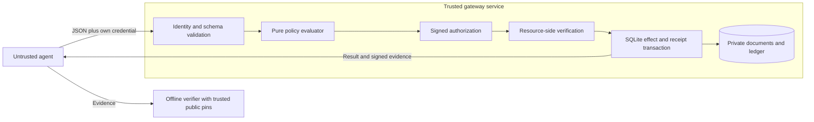

# V1 specification

## Objective and scope

Deliver an executable vertical slice of proof-carrying authorization. The controlled effect domain is an existing private document store, with exact-ID reads and writes. The first milestone is `Executed(A) => Checked(A) and Authorized_P(A)` at this resource boundary, under the assumptions in `THREAT_MODEL.md`.

The implementation is tested against a finite mathematical specification. No machine-checked theorem about the Python program is claimed. “Proof” in the V1 interface means a signed attestation plus inputs that permit independent checking of the policy decision.

## Architecture



Decision and enforcement have separate code paths, but share a trusted process and key in V1. Separating these into services is possible later; the current code does not claim protection against a compromised gateway component.

## Action language

`A = (version, actor, operation, resource, parameters)`.

- Version is integer `1` (a JSON boolean is not an integer here).
- Actor and operation are ASCII identifiers of 1–64 characters, starting alphanumeric, then alphanumeric, underscore or hyphen.
- Resources are `document:` followed by 1–128 characters, starting alphanumeric, then alphanumeric, underscore, hyphen or `/`. Empty segments and trailing slashes are rejected. IDs are case-sensitive.
- The namespace has no filesystem resolution. Dots, percent encoding, backslashes, absolute host paths and other URI schemes are rejected.
- `read` requires exactly `{}`. `write` requires exactly `{"content": string}` with at most 16 KiB of UTF-8 content. Writes replace an existing document; V1 has no create/delete operation.
- Unknown operations can be represented by the generic Action type but are always rejected by the closed tool registry, even if a policy contains an allow rule for them.
- Unknown action fields are rejected. There is no embedded authority, legality flag, credential, or trusted context supplied by the agent.

`Context` is currently the authenticated actor plus gateway-derived time, store identity, and current store state. These are passed separately and bound by the certificate. Future contextual claims need provenance and verification before entering this trusted context.

## Canonicalization: guard-json-v1

Use UTF-8, NFC-normalized strings, lexicographically sorted object keys by Unicode code point, no whitespace, unescaped non-ASCII characters, and JSON escaping as produced by Python `json.dumps(ensure_ascii=False)`. Reject non-NFC strings rather than changing their meaning. Lists preserve order. Null, booleans and integers in `[-(2^53-1), 2^53-1]` are supported. Floats, NaN, infinity, lone surrogates, duplicate object keys, non-string keys and nesting beyond 16 levels are rejected. Network JSON is limited to 128 KiB. Local history verification accepts up to 32 MiB.

This is a versioned project-specific profile, **not a claim of RFC 8785/JCS compatibility**. A new implementation must use the published profile and golden tests, including Unicode ordering. A future change to canonicalization requires a new protocol version.

`C(A)` is the canonical serialization, `H(A) = SHA256(C(A))`. Action equality is `C(A1) = C(A2)`; hash equality is used as a cryptographic commitment under SHA-256 collision resistance. Parameters are snapshotted into immutable bytes; access returns a fresh copy.

Policy rules are sorted by unique rule ID before canonicalization. Rule order has no semantics. IDs are included in the commitment because they appear in decision evidence.

## Authorization semantics

A rule is `(id, effect, actor, operation, resource)` where effect is `allow` or `deny`. Administrator provisioning is the authority root. V1 has no ownership discovery, delegation, wildcard matching or legal-rule inference.

Define:

```
Match(r, A) := r.actor = A.actor
            and r.operation = A.operation
            and r.resource = A.resource

Grant(P, A) := exists r in P.rules: Match(r, A) and r.effect = allow
Deny(P, A)  := exists r in P.rules: Match(r, A) and r.effect = deny

Authorized(P, I, A) := I = A.actor
                    and SupportedAndValid(A)
                    and Grant(P, A)
                    and not Deny(P, A)
```

`Policy.evaluate` implements this relation directly. It returns deny for identity mismatch and unsupported/malformed tool requests before checking rules; then explicit deny; then explicit allow; then default deny. All matching rule IDs of the decisive effect are returned in normalized order.

The test suite enumerates all 64 subsets of a six-rule universe across 24 actor/operation/resource/identity combinations (1,536 comparisons) against an independent set-based predicate. This checks the finite cases and precedence behavior; it does not prove correctness for all programs or policies.

A proof argument for the evaluator is short: an allow return is reachable only after identity and tool checks succeed, the matching deny set is empty, and the matching allow set is nonempty. These are precisely the conjuncts of `Authorized`. Turning this argument into a machine-checked theorem and relating an extracted evaluator to the runtime is future work.

## State and transaction semantics

```
S = {version: 1, store_id, revision, documents_hash}
documents_hash = H(sorted [[resource, H(content)], ...])
```

The random store ID is the certificate audience. The revision advances for every successful execution, including reads, so each certificate is bound to one position in a serial history. This intentionally conservative design invalidates other outstanding certificates after any successful action. For normal use, `/v1/act` authorizes and executes in one transaction.

Inside `BEGIN IMMEDIATE`, resource enforcement checks the pinned signature, type/version, actor, exact action, policy, source, audience, current state, time, nonce, and policy decision again. It applies the exact validated Action, advances revision, signs the execution receipt and inserts the consumed nonce and bundle. SQLite commits all changes together. An exception rolls back all changes. A duplicate nonce has a database uniqueness constraint, in addition to an explicit check.

Read result release occurs after commit; reading bytes internally is part of the trusted execution. Missing documents and internal failures return no success receipt. They do not consume the certificate. At most one execution can commit for a particular authorization certificate, including across ordinary restarts and concurrent requests. This is not exactly-once delivery or deduplication of newly authorized equivalent requests.

## Evidence protocol

Signatures are Ed25519 over `b"agent-guard/signed-json/v1\\x00" + canonical(payload)` (the final domain byte is NUL). The envelope has exactly `payload` and a standard padded Base64 `signature`. Payload `kind` and `version` prevent mixing authorization and execution statements. Trust pins come from the administrator, never the untrusted envelope.

| Authorization field | Meaning |
|---|---|
| `actor`, `action_hash` | Authenticated principal and exact proposed action |
| `policy_hash`, `rule_ids`, `reason`, `decision` | Committed rules and evaluated decision |
| `state_hash`, `audience` | Current state and unique target store |
| `verifier_hash` | SHA-256 of a canonical filename-to-file-hash manifest of package Python files |
| `nonce` | 32 random bytes encoded as 64 hexadecimal characters |
| `issued_at`, `expires_at` | Server Unix seconds; `issued_at <= execution_time < expires_at <= issued_at + 30` |

Execution evidence includes the authorization envelope hash, action/policy/source hashes, pre/post-state hashes, result hash, sequence, execution timestamp, status `executed`, and previous receipt hash. The bundle carries the action, authorization, execution envelope, result, and both state objects. Full content is deliberately visible in this MVP; it is not a zero-knowledge protocol.

Historical verification checks validity at signed execution time, not the auditor's current wall clock. A certificate that is now expired can still support a past execution. Offline verification does not make it executable again.

Full-chain verification starts at sequence 1 and a null previous receipt. It checks each signature, policy decision, sequence, state continuity, and receipt hash link. A trusted external head detects suffix truncation. A single receipt verifies only that receipt's statement, not the completeness of the history.

## HTTP contract

All POST requests require `Authorization: Bearer TOKEN` and exactly one `Content-Type: application/json` and `Content-Length` header. The server derives actor from a SHA-256 token lookup using constant-time comparisons, not from `Action.actor`, proxy headers, or an agent-supplied identity context. Example credentials are random 256-bit tokens. Only their hashes are in the identity map.

| Route | Body | Success |
|---|---|---|
| `GET /health` | none | Minimal health response |
| `POST /v1/authorize` | `{"action": A}` | `{action, authorization}`; no effect |
| `POST /v1/execute` | `{"action": A, "authorization": envelope}` | Full execution bundle |
| `POST /v1/act` | `{"action": A}` | Authorize and execute atomically, returning full bundle |

Rejections use 400 for invalid input, 401 for invalid credentials, 403 for denied or invalid authorization, 404 for missing routes/resources, 413 for oversized input, 415 for content type, and 503 for internal failures. Well-formed policy denials from `act`/`authorize` include signed decision evidence. Malformed input, failed authentication and operational errors return an error code without a signed execution statement. Responses are `no-store`; the server exposes no document-listing or administration endpoint.

## Acceptance criteria

1. An allowed document read/write succeeds and yields independently verifiable evidence.
2. Denied, malformed, unsupported, spoofed, unsigned, stale, expired, substituted and replayed requests cause no committed effect.
3. Concurrent submissions of one certificate yield at most one success; ordinary concurrent actions yield a valid serial chain.
4. Write, nonce consumption and evidence recording commit together; simulated audit failure rolls back all three.
5. Signature, content, state, policy, source and chain tampering are rejected by offline verification.
6. Runtime policy/key/source mismatches fail startup; the service does not silently reuse a store under different trust settings.

See the executable tests for coverage and `ROADMAP.md` for the next milestones.
