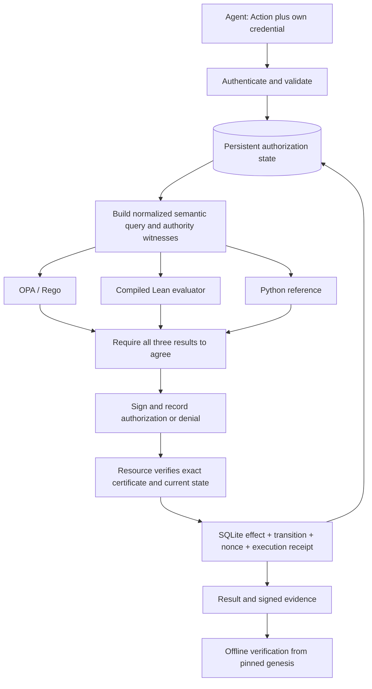

# Parts 2 and 3: a reusable stateful authorization primitive

## Contract

Given an administrator-provisioned policy, authenticated principal, registered effect interpretation, current authorization state and exact Action, the gate either denies or commits an authorized transition with evidence. A verifier can replay the policy decision and transition against independently pinned trust material.

The core distinction is between three statements:

1. **Authorization:** the specified relation permits this exact action in this state.
2. **State transition:** the next recorded security state is exactly the defined transition.
3. **Execution attestation:** the trusted resource service claims the local effect committed, or the external intent was queued.

The first two are computationally replayable; Lean establishes properties of the executable semantic checker. The third relies on the resource boundary and its implementation. Cryptography authenticates and binds these statements; it does not independently observe the world.

## Architecture



OPA is a decision engine, never the history database. Lean's executable is built from the same definitions used by the proofs. Python constructs typed input and controls storage/effects. There is no fallback to a weaker evaluator.

## Action, policy and context

V2 Action fields are `version: 2`, `actor`, `operation`, `resource`, and `parameters`. Construction snapshots nested parameters into immutable canonical bytes. Duplicate keys, ambiguous numbers, non-normalized Unicode and unsupported fields are rejected using the existing canonical profile. Network messages are bounded at 128 KiB; individual values/payloads at 16 KiB.

Operation identifiers are lower-case ASCII names such as `data.read`, `database.query`, or `message.send`. A policy explicitly maps each name to one of five supported effects. A name by itself cannot install or invoke code.

Resource identifiers use a bounded `scheme:opaque/path` grammar. Multiple namespaces can coexist (`document:`, `kv:`, `sink:`, `authority:`). Identifiers do not resolve to host paths, URLs, email addresses or shell commands. A trusted resource catalog classifies each registered resource as object, sink or authority endpoint. The sink's accepted labels are administrator-provisioned, never supplied by the agent's payload.

The policy contains principals, administrators, known label names, root grants, explicit denials, operation/effect mappings, the resource catalog and optional per-principal/per-operation budgets. Policy and evaluator artifacts are fixed for a store. Authority can evolve through checked delegation/revocation without replacing that policy.

The authenticated principal, gateway time, current state and resource classification are trusted context. They are not accepted from the request. The application is responsible for correct identity provisioning and for isolation between the gateway and agent.

## AuthorizationState

```
version          protocol version 2
domain           random identifier for one protection domain
step             number of successful local effects
grants           root and derived authority records
revoked          permanent set of revoked grant IDs
active_labels    persistent domain-wide information-flow labels
objects          resource -> {labels, value_hash}
counts           principal -> operation -> successful-use count
facts            reserved typed state facts; currently empty and never agent-set
outbox_hash      rolling commitment to queued intents
```

All state snapshots are immutable. Security-relevant summaries drive authorization; the full trace stays in the event ledger. Read values are stored privately and committed by hash. Catalog and policy labels are trusted initial classifications. Reading a value whose hash differs from its recorded commitment fails closed.

The implementation bounds catalogs/principals, labels, and grant graph size to prevent an unbounded semantic input. It permits 64 registered resources, 64 root grants, 256 total grants and delegation depth at most 16. Histories and outbox storage grow persistently and need operational quotas in a deployment. Local history-file verification is capped at 128 MiB.

## Rooted authority and attenuation

A grant contains `id`, `issuer`, `subject`, `operation`, `resource`, `prefix`, `expires`, `remaining`, and `parent`. Initial roots must be issued by configured administrators and have no parent.

An exact scope covers only its resource. A prefix scope covers that resource and IDs starting with `resource + '/'`. It never grants authority to a near-prefix such as `document:project-evil`. There is no regex or raw wildcard matching.

Every derived grant must have a valid root-to-leaf witness. Each edge must satisfy:

- Child parent ID equals the actual parent's ID.
- Child issuer equals the parent's subject.
- Operation is unchanged.
- Resource scope is contained in the parent's scope; an exact scope cannot become a prefix.
- Child expiry is no later than the parent's.
- Remaining delegation depth strictly decreases.

Every witness node must be unrevoked and unexpired. The root must equal an actual policy root, not an agent-provided assertion. Derived IDs must be fresh, their recipients must be known principals, and the issuer must be the authenticated actor. Missing links, cycles, amplification and forged roots do not authorize anything. Strictly decreasing depth bounds valid chains independently of parser limits.

`authority.delegate` carries the complete child grant and uses its target scope as the Action resource. An explicit denial of the underlying operation also prevents delegating that denied authority. `authority.revoke` targets a grant ID at a registered authority endpoint. Administrators, the grant's issuer, or its subject may revoke it; unrelated principals may not. Root revocation invalidates every descendant because each use rechecks the entire chain. Revocation changes the state commitment, invalidating outstanding certificates as well.

There is no unrevocation or silent grant renewal. A future lifecycle protocol must make renewed authority a new explicit grant with its own provenance.

## Authorization relation

For an ordinary read, write or send, allow requires:

```
supported typed effect
AND authenticated identity = Action.actor
AND known principal
AND usage count below any configured budget
AND no matching explicit denial
AND a valid root-to-leaf authority witness covering the exact action
AND information-flow requirements
```

Delegation additionally checks the proposed child's attenuation and freshness. Revocation uses the explicit revoker relation instead of a data-access grant. OPA and Lean independently evaluate these predicates on the normalized query; Python implements the same reference relation. Denial is the default. Evaluator failure or disagreement is an operational rejection, not a signed claim that a successful decision occurred.

The query hash binds the exact normalized input, including evaluation time and candidate witness chains. Python's translation from typed state to this query remains a trusted implementation boundary; it is documented rather than called a formally verified compiler.

## Information flow and transition

Successful reads union the object's labels into `active_labels`. Writes union `active_labels` into the destination object's existing labels and update its value commitment. Neither overwriting content nor issuing a new certificate removes labels. A send is allowed only if every active label is accepted by the registered sink.

Labels apply to the **whole protection domain**, including all its agent identities. This deliberately conservative choice prevents bypass by switching identities or delegating to a previously untainted subagent. It can block unrelated public work after a private read; that is the chosen correctness-first behavior. Distinct domains must actually be isolated, and must label any data imported between them. The system cannot track unobserved memory transfer or direct access outside its boundary.

The pure `transition` function handles state evolution separately from authorization. A successful transition increments step and the operation count, then applies the effect-specific changes. It validates observed read/result commitments. Offline verification recomputes this entire transition and rejects an incorrect next state even when someone has signed it with the correct key.

There is no declassification operation, model-based “this summary is safe” exception, or inference of the truth of free-form facts. New ways to remove labels would require a separately specified authority and proof obligation.

## Part 3: two kinds of signed event

Authorization and execution have separate `kind` and `status` values in protocol V2. Both bind domain, authenticated principal, canonical action hash, policy hash, evaluator manifest hash, before/after state hashes, query hash, decision, time, nonce, sequence and previous-event hash.

An authorization event is `authorized` or `denied`, leaves state unchanged, binds a 30-second expiry, and carries no execution result. It is persisted in the hash chain before its certificate can be consumed. A well-formed denied action therefore has durable signed evidence as well.

An execution event refers to the exact authorization envelope, binds a result hash, and is `executed` for local effects or `queued` for a send intent. Its state is computed from the current snapshot and the actual local result. The resource checks signature, source/policy/domain pins, actor/action equality, issuance record, unused nonce, current state, expiry and current semantics. Grant expiry during the certificate's 30-second window still blocks execution.

The same transaction commits the resource effect, authority/label/counter transition, consumed nonce and execution event. Signing, serialization, engine or audit failure rolls back that transaction. `/v2/act` performs authorization and execution in the same transaction. Separate authorize/execute calls permit transport or workflow separation but can encounter stale state.

At-most-once applies to a certificate, not to a semantic intention resubmitted for new authorization. A lost response after commit is ambiguous to the caller; reconcile the ledger before authorizing a fresh request. No exactly-once network-delivery claim is made.

## Verification and recovery

The administrator distributes `trust.json` containing the public key, policy, engine/source manifest and genesis state through a trusted channel. An untrusted sender providing a key alongside a receipt does not establish trust.

Single-event verification checks signature/bindings, re-evaluates the semantic query with all three engines, checks embedded authority and recomputes the transition. It does not establish complete history. Full-history verification starts at the pinned genesis, checks every event's predecessor, state continuity and sequence, and requires an earlier unique issuance for every consumed certificate. Signed denial events also participate in the chain.

At startup the service compares database trust metadata against the separately supplied trust record, replays the full signed history, and compares the resulting state to the stored snapshot. It also verifies private object value commitments, the outbox commitment and materialized nonce consumption records. It refuses inconsistent state.

A valid prefix remains a valid prefix. Keep a receipt-head checkpoint outside the service and supply `--head HASH` to detect suffix removal during an audit. Protection against wholesale rollback of both database and external trust/checkpoint storage requires an independent monotonic anchor. That is a deployment requirement, not something local hash chaining solves.

## Artifact and schema binding

The manifest commits to the actual OPA executable, Rego bytes, compiled Lean executable, available Lean source files and Python package sources used by the gateway. Runtime checks rehash the engine artifacts before evaluations. The bootstrap downloads versioned release assets with checked SHA-256 digests, checks Lean theorem dependencies, and compiles the runtime evaluator.

This is build provenance under administrator control, not hardware attestation. The Lean compiler/runtime, OPA, Python, SQLite, crypto library, OS, clock and artifact-to-process loading remain trusted. The proof is not a theorem about that entire stack.

Protocol V1 and V2 are explicitly distinct. V2 requires a new store and trust root. Old receipts remain verifiable using their original trust material. Source/key/policy changes do not silently resume a V2 store; controlled migration and historical epoch management need a separate protocol.

## Adapter and deployment contract

This version implements a general authorization/attestation interface over a finite set of effects. Two different object namespaces share the same transactional structured-value adapter. Any permitted external operation can be represented as a sink-specific queued JSON intent. Resource classification and effect interpretation are trusted registrations.

There is intentionally **no dispatcher** pretending that arbitrary remote APIs can share the local transaction. To attach an actual service, its adapter must:

1. Bind the complete destination, method, arguments, payload and identity to the checked Action.
2. Prevent any alternate unmediated credential or resource path.
3. Verify authorization at the recipient or a resource-owning gateway.
4. Specify idempotency, expiry/revocation at dispatch, and how policy/state changes affect queued work.
5. Durably distinguish pending, confirmed, rejected and unknown outcomes; reconcile a crash or lost acknowledgement.
6. Produce evidence for what the service actually confirms and update labels from trusted observed results.

Do not reinterpret a `queued` receipt as an execution capability for an arbitrary endpoint. It attests an intent admitted to this local queue. Delivery needs the above protocol and its own authorization boundary.

The bundled HTTP server is still a development transport. A pilot needs separate OS/container/host identities, private gateway state, authenticated TLS, resource/connection quotas and restricted agent tool/network access. The repository does not install an OS sandbox. Complete mediation is an integration assumption, just as protecting a private key is an assumption of a cryptographic deployment.

## What remains outside the claim

Universal legal compliance, arbitrary shell/browser semantics, covert/timing channels, malicious administrators, compromised runtimes, side-channel noninterference, label provenance for unobserved inputs, unrestricted inter-domain communication, key compromise and independently witnessed remote effects. These require concrete scope and additional mechanisms. The result is a reusable stateful security primitive with explicit assumptions, not a universal safe-agent certificate.
